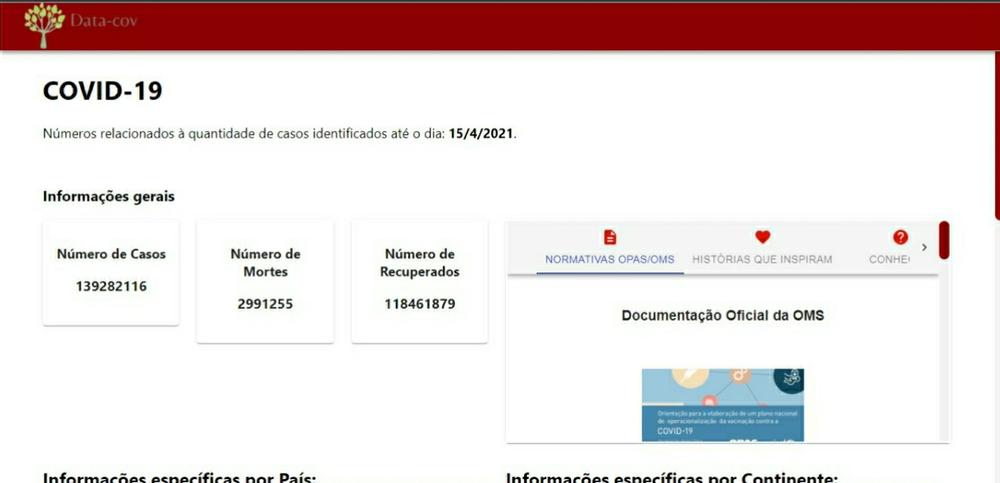
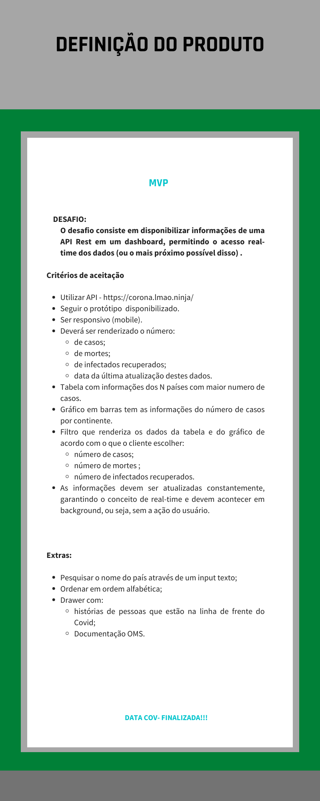

Esse projeto foi realizado para o Talent Fest- turma SAP005 - finalizando o Bootcamp da Laboratoria.

[**Conheça a Data-cov :computer:**] (https://tivit-covid19.vercel.app/)
> Status do Projeto: concluído :heavy_check_mark:

---

## Índice

- [1. Apresentação do Projeto](#1-apresentação-do-projeto)
  - [1.2 Conhecendo a interface](#1.1-conhecendo-a-interface)
- [2. Planejamento Ágil](#2-planejamento-agil)
- [3. Desenvolvimento](#4-desenvolvimento)
  - [3.1 Critérios mínimos de aceitação do projeto](#3.1-problema-a-ser-resolvido) 
  - [3.2 Protótipos](#3.4-protótipos)
- [4. Habilidades Desenvolvidas](#4-habilidades-desenvolvidas)  
- [5. Desenvolvedoras](#5-desenvolvedoras)

---

## 1. Apresentação do Projeto :clipboard:

A Code-vac é um dashboard feito especialmente para uma empresa especializada na distribuição de materiais hospitalares para auxiliar na tomada de decisões estratégicas. 
O desafio foi proposto pelos colaboradores da TIVIT: "Avisualização dos dados faz parte do nosso dia-a-dia na Tivit. Ainda que softwares processem dados e as APIs (Application Programming Interfaces) nos permitam acessar esses dados, muitas vezes é necessária adaptação e manipulação dessas informações para que possamos visualizá-las e assim trazer o impacto desejado para nossos clientes."

### 1.3 Conhecendo um pouco da interface

Esta aplicação foi pensada para que os colaborares da empresa possam utilizar intuitivamente os recursos disponíveis e que ao mesmo tempo facilite o acesso aos dados referente ao Covid para tomada de decisões estratégicas. Acessando o site da [Data-Cov](https://tivit-covid19.vercel.app/), será possível verificar os dados por país ou continente.

---

## 2. Planejamento Ágil :memo:

Utilizou-se a ferramenta _Trello_ para planejar as ideais e organizar as tarefas.
Se quiser saber um pouco mais sobre o planejamento, basta acessar esse [link](https://trello.com/b/SKLkk6EW/desafio-tivit).

## 3. Desenvolvimento

### 3.1 Critérios mínimos de aceitação do projeto

### 3.2 Prótipos

O projeto foi desenvolvido utilizando protótipos de média fidelidade fornecidos pelos colaboradores da TIVIT. Para ter acesso ao prótipo e todas as informações sobre o desafio, acesse [AQUI](src/Img/Desafio_TivitTF_SAP005.pdf)

## 4. Habilidades Desenvolvidas :dart:

:pushpin: HTML semântico 
:pushpin: CSS  
:pushpin: Javascript  
:pushpin: Colaboração pelo Github 
:pushpin: Design Sprint 
:pushpin: MVP (Mínimo Produto Viável) 
:pushpin: Manipulação de API 
:pushpin: React.js 
:pushpin: Material UI

#### Soft Skills

:pushpin: Colaboração 
:pushpin: Trabalho em equipe 
:pushpin: Diálogo entre a dupla 
:pushpin: Manejo do estresse 
:pushpin: Planejamento 
:pushpin: Saber pedir ajuda às colegas e aos mentores

## 5. Desenvolvedoras :computer:

#### :octocat: [**Edilene Fernandes**](https://github.com/edilenefern) 

#### :octocat: [**Juliane Cristina**](https://github.com/Juliane-C) 

#### :octocat: [**Luciana Pereira**](https://github.com/luciana-pereira) 

#### :octocat: [**Mairã Soares**](https://github.com/MairaSoares)

#### :octocat: [**Thaís Alencar**](https://github.com/alencartha) 

---
